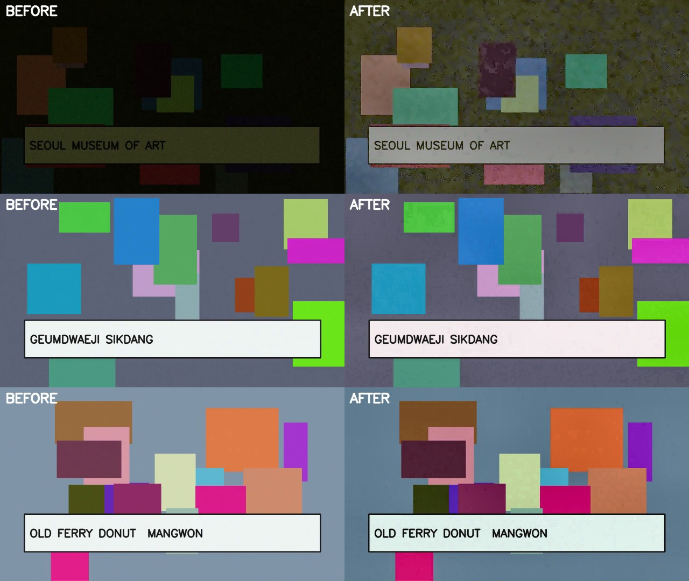
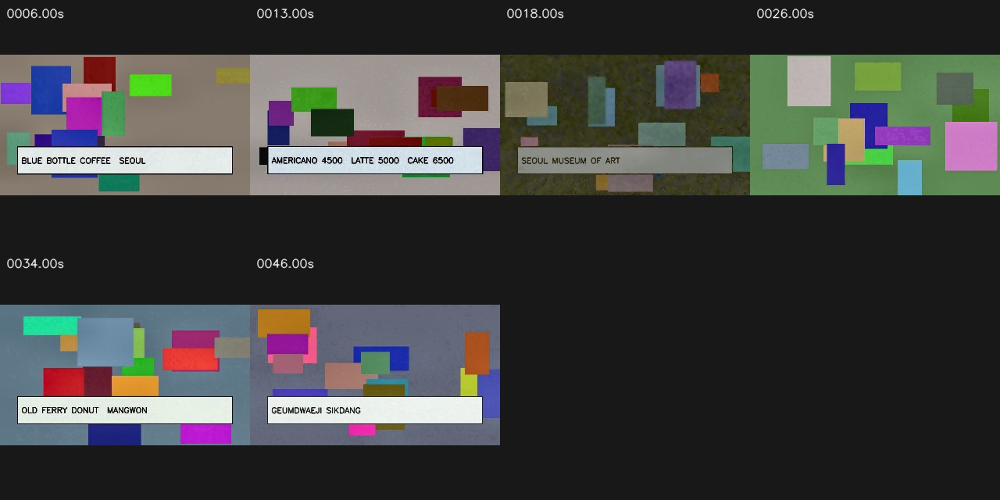

# Pind

**영상 속 장소를 지도로.** YouTube 브이로그를 넣으면 창작자가 실제로 방문한 카페·식당·전시장을
추출해 지도에 꽂고, 각 마커에서 그 장소가 나온 영상 구간으로 바로 이동한다.

특허 출원 「영상 콘텐츠 기반의 여행 정보 제공 방법 및 시스템」 · 창업경진대회 대상 (백석대) ·
최우수상 (충남 RISE 대학 연합)

---

## 핵심 기술 — 비전 프론트엔드

장소를 알아내는 가장 결정적인 단서는 **간판에 적힌 가게 이름**이다. 그래서 이 프로젝트의
기술적 중심은 "간판이 읽히는 프레임을 VLM에게 보여주는 일"에 있다.

영상을 1 fps로 균일 샘플링해 그대로 멀티모달 모델에 넘기면 두 가지가 동시에 잘못된다.
대부분의 프레임이 앞 프레임과 중복이라 토큰만 쓰고, 정작 필요한 실내·저조도 프레임은
간판이 어둠에 잠겨 못 읽힌다. 두 문제의 해법은 반대다 — **중복은 버리고, 어두운 건 복원한다.**

### 어두운 프레임을 버리지 않고 살린다



화질 게이트 **앞에** 저조도 복원을 배치한 것이 이 모듈의 핵심 설계다. 순서를 반대로 두면
실내에서 방문한 장소가 "품질 미달"로 파이프라인에서 통째로 사라진다. 실제로 첫 구현이
그랬고, 검증 영상의 전시장 장면 7프레임이 전부 탈락해 간판이 결과에서 없어졌다.

| 실내 전시장 프레임 | 복원 전 → 후 |
|---|---|
| 평균 휘도 | 0.070 → **0.306** |
| RMS 콘트라스트 | 0.061 → **0.134** |
| 선명도 (Laplacian var) | 760 → **8,674** |

sRGB 도메인 미니 ISP: 화이트밸런스(Shades-of-Gray) → 적응 감마 → 조건부 NL-Means
디노이징 → LAB L채널 CLAHE → 조건부 언샤프 마스킹.

### 중복은 장면 임베딩으로 접는다

| 단계 | 프레임 | 원본 대비 |
|---|---:|---:|
| 디코딩 (1 fps) | 53 | 100.0% |
| 화질 게이트 통과 | 43 | 81.1% |
| 샷 분할 | 7 | 13.2% |
| **최종 VLM 입력** | **6** | **11.3%** |

**프레임 88.7% 감축**, 처리 시간은 영상 길이의 0.30배 (CPU). 간판이 있는 장면 4개는
모두 살아남았고, 언더노출로 버려진 프레임은 0장이다.



임베더는 `Embedder` 프로토콜 뒤에서 교체된다. 기본은 pHash+HSV 히스토그램(의존성 없음,
프레임당 1ms 미만), 옵션으로 DINOv3 ViT-S/16 CLS 임베딩. 같은 장소를 다른 각도에서 찍은
컷을 묶는 데는 DINOv3가 유리할 것으로 보고, 두 임베더 비교가 다음 실험이다.

### 감축률은 혼자서는 거짓말을 한다

프레임을 1장만 남기면 감축률은 98%가 된다. 그래서 **장소를 몇 곳 잃었는지**를 따로 잰다.
정답 간판 문자열을 아는 장면(장소 8곳, 저조도 3곳, 재방문 3곳)을 만들고, 판정은 파이프라인
자신의 점수가 아니라 **외부 OCR(tesseract)**에 맡긴다.

| 설정 | 선별 프레임 | 장소 보존 | 저조도 장소 | 장소당 프레임 |
|---|---:|---:|---:|---:|
| 오라클 (선별 없음) | 55 | 8/8 | 3/3 | — |
| **비전 프론트엔드** | **12** | **8/8** | 3/3 | 1.5 |
| 저조도 구제 끔 | 11 | 7/8 | **2/3** | 1.6 |

55장을 다 넣었을 때와 **같은 장소를 찾으면서 VLM 입력을 78% 줄였다.**

이 검증을 시작하고 나온 첫 숫자는 6/8이었다. 감축률만 보던 동안 결함 5개가 숨어 있었고,
전부 "잘 줄이는 것처럼 보이면서 장소를 버리는" 종류였다 — 전역 퍼센타일 블러 컷이 선명한
저텍스처 장면을 통째로 버리고, 저조도 보정이 선명도 스케일을 바꿔 정상 노출 프레임을 밀어내고,
고정 유사도 임계가 한 장소를 여러 샷으로 쪼개고, 예산 컷이 점수 순이라 한 장소가 슬롯을
독식하고, 전체 ISP의 디노이징이 어두운 간판의 획을 지웠다. 고친 뒤 **프레임은 16 → 12장으로
줄고 보존률은 6/8 → 8/8로 올랐다.**

> 위 수치는 **합성 검증 영상** 기준이다(정답 레이블이 필요해서 장면을 합성으로 만들었고,
> 실제 YouTube 영상은 저작권·재현성 문제로 레포에 넣을 수 없다). 따라서 "이런 조건에서
> 장소를 잃지 않는다"는 뜻이고, 실제 브이로그에서의 성능을 보장하지는 않는다. 실제 입력인
> 유튜브 영상 3편(장소 26곳)에서는 **4/26 (오라클 19/26)** 으로, 실영상에서 프레임 선별이 무작위
> 수준임을 확인했다. 원인(문자 점수 포화)과 대안 비교는 docs/vision-frontend.md 「유튜브 실측 결과」.

**설계 근거와 실패했던 시도, 측정값 전체 → [docs/vision-frontend.md](docs/vision-frontend.md)**

```bash
cd apps/api
python benchmarks/make_sample_video.py sample_vlog.mp4
python benchmarks/bench_keyframes.py sample_vlog.mp4 --out-dir bench_out
```

---

## 아키텍처

```
 Chrome 확장 (Plasmo)          Web (Next.js)
 "이 영상 Pind에 저장"          지도 · 장소 목록
         │                          │
         └──────────┬───────────────┘
                    ▼
            Supabase (Auth · Postgres 15 + PostGIS · Realtime)
                    │  Database Webhook
                    ▼
            FastAPI  ── AI 파이프라인 ──────────────────────┐
                         yt-dlp 다운로드                    │
                         ├── 오디오 → faster-whisper → 자막 │
                         └── 프레임 → 비전 프론트엔드 ──────┤
                                        (이 레포의 핵심)     │
                                                             ▼
                                              Gemini (장소 후보 추출)
                                                             │
                                              후보 dedup + Google Places 지오코딩
                                                             │
                                                     places 테이블 (Geography POINT)
```

## 기술 스택

| 영역 | 스택 |
|---|---|
| 백엔드 | FastAPI · SQLAlchemy 2.0 · Alembic · GeoAlchemy2 · Pydantic v2 |
| DB | Supabase (PostgreSQL 15 + PostGIS 3, SRID 4326, GIST 인덱스, RLS) |
| 비전 | OpenCV · NumPy · DINOv3 (옵션) |
| AI | Gemini (멀티모달) · faster-whisper · Google Places API |
| 웹 | Next.js 14 · React 18 · Tailwind v3 · shadcn/ui 2.3 · Leaflet · TanStack Query · Zustand |
| 확장 | Plasmo 0.90 · React 18 |
| 모노레포 | pnpm workspace · Makefile · pre-commit |
| 품질 게이트 | ruff (ANN 포함) · mypy `strict` · pytest · ESLint 9 flat config |

타입은 손으로 쓰지 않는다. Pydantic → OpenAPI → `openapi-typescript` 로 생성해
`packages/shared-types`에 커밋한다 (`make gen-types`).

## 실행

```bash
pnpm install
make dev            # Web(:3000) + API(:8000)
make verify         # ruff + mypy strict + ESLint + tsc, 모노레포 전체
make test           # pytest
make migrate        # Alembic
```

DB는 Supabase Cloud Session Pooler에 직접 붙는다(로컬 Docker 불필요). 로컬 Postgres가
필요하면 `make db-up`.

## 진행 상황

- [x] **Phase 0** 모노레포 부트스트랩 (0-1 ~ 0-10)
- [x] **비전 프론트엔드** — 화질 지표 · 미니 ISP · 문자 saliency · 장면 dedup · 벤치마크 (테스트 79개)
- [ ] **Phase 1** DB 모델 & DTO
- [ ] **Phase 2** 프론트엔드 뼈대
- [ ] **Phase 3** AI 파이프라인 본체 (Gemini 연동 · 후보 resolve · orchestrator)
- [ ] **Phase 4** Realtime & UI 완성
- [ ] **Phase 5** 보안 & 배포

세부 체크리스트와 의사결정 로그(ADR): [PROGRESS.md](PROGRESS.md)

## 문서

| 문서 | 내용 |
|---|---|
| [docs/vision-frontend.md](docs/vision-frontend.md) | 비전 프론트엔드 설계 근거 · 장소 보존률 검증 · 한계 |
| [PROGRESS.md](PROGRESS.md) | Phase별 진행 상황과 ADR |
| [CLAUDE.md](CLAUDE.md) | 레포 전체 컨벤션 |
| [apps/api/CLAUDE.md](apps/api/CLAUDE.md) | 백엔드 컨벤션 (SQLAlchemy · Pydantic · 파이프라인 규칙) |
